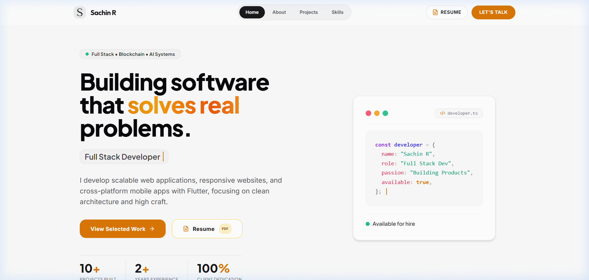

# 🌐 Sachin R. | Developer Portfolio

Welcome to the repository for my personal developer portfolio, live at **[sachinr.vercel.app](https://sachinr.vercel.app)**. This website showcases my projects, engineering focus areas, technical skills, and experience.



---

## ✨ Features

- **Cinematic Card Stacking**: Smooth, overlapping card-deck scrolling animation for the projects section.
- **Interactive 3D Tilt Cards**: Fluid 3D mouse-tracking rotation on the hero element.
- **Ambient Lighting Effects**: Subtle warm ambient gradients and glow animations responsive to viewports.
- **Dynamic Typing Text**: Auto-cycling typing animations highlighting specialized roles.
- **Intersection-Triggered Counters**: Stats counters that animate smoothly when scrolled into view.
- **Responsive Layout**: Designed for optimal readability across mobile, tablet, and desktop screens.

---

## 🛠️ Tech Stack

- **Core Framework**: [Next.js 15](https://nextjs.org/) (App Router, React 19)
- **Styling**: [Tailwind CSS](https://tailwindcss.com/)
- **Animations**: [Framer Motion](https://www.framer.com/motion/)


---

## 🚀 Getting Started

### Prerequisites

- Node.js (v18.x or higher)
- npm or yarn

### Installation

1. Clone the repository:
   ```bash
   git clone https://github.com/Codsach/portfolio.git
   cd portfolio
   ```

2. Install dependencies:
   ```bash
   npm install
   ```

3. Run the development server (runs with Turbopack on port `9002`):
   ```bash
   npm run dev
   ```
   Open [http://localhost:9002](http://localhost:9002) in your browser to see the result.

4. Build for production:
   ```bash
   npm run build
   ```

---

## 📬 Contact & Connect

- **Email**: [rsachinsachi@gmail.com](mailto:rsachinsachi@gmail.com)
- **LinkedIn**: [Sachin R](https://www.linkedin.com/in/sachinr-dev/)
- **GitHub**: [@Codsach](https://github.com/Codsach)
